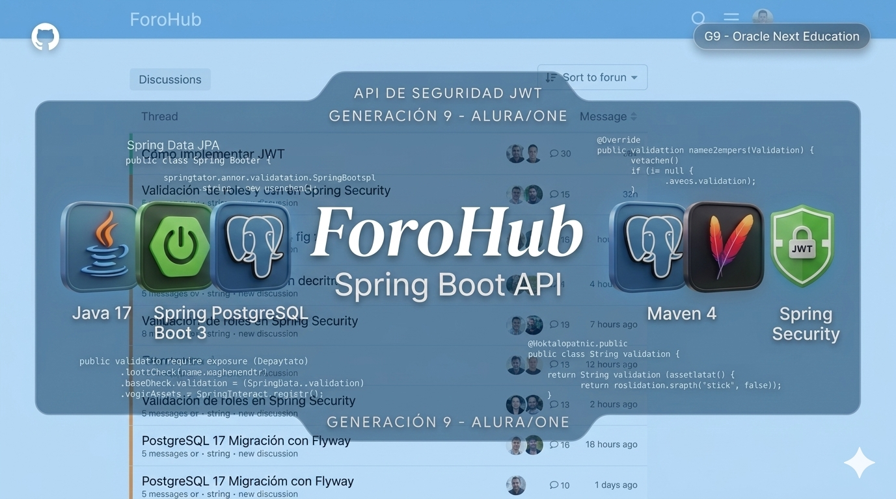

# Spring Framework Challenge - ForoHub

  

  
  
  
  
  

## 📝 Descripción del Proyecto

**ForoHub** es una solución Backend desarrollada bajo el ecosistema de Spring Framework, diseñada para la gestión integral de un foro de discusión técnico. El proyecto cumple con los requerimientos del Challenge de Alura Latam y Oracle Next Education (ONE), implementando un sistema persistente para la administración de tópicos, respuestas, usuarios y cursos.

La aplicación garantiza la integridad de los datos mediante validaciones estrictas y un sistema de seguridad robusto que protege la información sensible y restringe el acceso según el rol del usuario (Estudiante o Instructor).

## 🎥 Demostración y Pruebas (Video)

  <table border="0">
    <tr>
      <td align="center"><b>1. Gestión de Tópicos</b></td>
      <td align="center"><b>2. Seguridad y JWT</b></td>
      <td align="center"><b>3. Administración de Usuarios</b></td>
    </tr>
    <tr>
      <td align="center"></td>
      <td align="center"></td>
      <td align="center"></td>
    </tr>
    <tr>
      <td align="center"><b>4. Cursos y Respuestas</b></td>
      <td align="center"><b>Documentación</b></td>
    </tr>
    <tr>
      <td align="center"></td>
      <td align="center"></td>
      <td align="center"><i>Próximamente</i></td>
    </tr>
  </table>

## 🛠️ Stack Tecnológico

* **Lenguaje:** Java 17 (JDK)
* **Framework:** Spring Boot 3.4.3
* **Gestión de Dependencias:** Maven
* **Base de Datos:** PostgreSQL 17
* **Persistencia:** Spring Data JPA
* **Migraciones:** Flyway
* **Seguridad:** Spring Security (Stateless) con autenticación JWT
* **Documentación:** Swagger / OpenAPI
* **Cliente de Pruebas:** Insomnia

## 🔐 Implementación de Seguridad

La seguridad se basa en una arquitectura de autenticación **Stateless** mediante tokens JWT. Se han definido permisos granulares para garantizar que cada recurso sea accedido únicamente por los perfiles autorizados:

* **Consultas (GET):** Acceso permitido a cualquier usuario autenticado.
* **Gestión de Tópicos (POST/PUT):** Exclusivo para el rol de Estudiante e Instructor.
* **Moderación y Administración (DELETE):** Acceso restringido únicamente al rol de Instructor.
* **Gestión de Cursos y Usuarios:** Rutas administrativas protegidas bajo autoridad de Instructor.

## 📊 Arquitectura de Datos

El diseño de la base de datos sigue el modelo relacional, utilizando **PostgreSQL** y **Flyway** para el control de versiones del esquema. Esto asegura que la base de datos sea escalable y fácil de mantener a medida que el foro crece.

## 🚀 Instalación y Uso

1. Clonar el repositorio.
2. Crear la base de datos en PostgreSQL.
3. Configurar las credenciales de acceso en el archivo de propiedades del proyecto.
4. Ejecutar el comando: `mvn spring-boot:run`

---

## 👨‍💻 Autor

Desarrollado por **Miguel Àngel de la Cruz Làzaro**.
